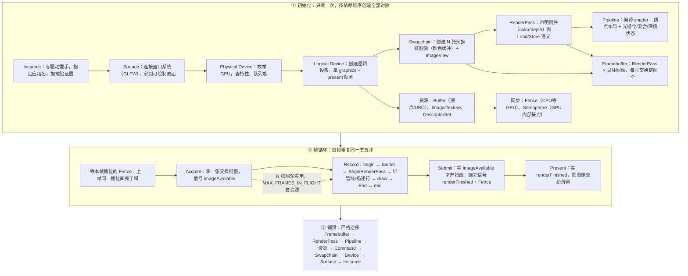
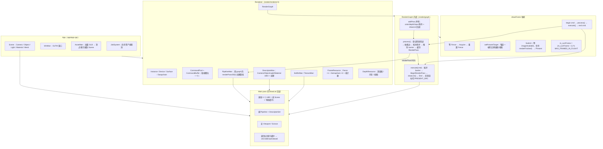

# Vulkan 与 SuperVK 渲染架构流程图

> 本文档配套 render graph 学习使用：上半是 Vulkan 从创建到销毁的完整流程，下半是你仓库（SuperVK）现在的分层与每帧的实际调用链，最后是一帧的逐步走查。

## 一、Vulkan 完整生命周期

**要点**：创建顺序就是依赖顺序，销毁顺序就是它的逆序；帧循环只是中间那段五步舞曲的无限重复。所有"释放复杂"的焦虑，本质都是想把第三段做好。

## 二、SuperVK 现在的架构与一帧的运行

**三个容易看漏的细节**：

1. **管线挂在图的 render pass 上**（`G2 → R2` 那条边）：init 里必须先 `addPass` + `process()`，管线才能拿到 `renderPassOf(0)` 创建。
2. **process 和 execute 的分工就是 render graph 模型**：`process()` = 声明变成排序和 barrier，`execute()` = 真正录制。两者都在 `drawFrame` 里每帧被调用，中间夹着 `setPresentTarget`。
3. **三件同步工具的职责**：Fence 管"同一槽位的上一帧"；`imageAvailable` semaphore 管"acquire 的图可以开始画了"；`renderFinished` semaphore 管"画完才能 present"。两个帧槽位轮换，所以 CPU 录第 N+1 帧时 GPU 正在画第 N 帧。

## 三、一帧的逐步走查（CPU / GPU 接力）

| 步 | 侧  | 动作             | 说明                                                                                            |
| -- | --- | ---------------- | ----------------------------------------------------------------------------------------------- |
| 1  | CPU | 等 Fence         | 等上一帧同一槽位画完，确认 GPU 已用完这套 FrameResource，CPU 才能安全写入                       |
| 2  | CPU | Acquire 交换链图 | `vkAcquireNextImageKHR` 拿一张交换链图；GPU 准备好后信号 `imageAvailable`                   |
| 3  | CPU | 录制命令         | begin → 图已算好的 barrier → BeginRenderPass → 绑管线/描述符 → draw → EndRenderPass → end |
| 4  | CPU | Submit           | `vkQueueSubmit`：等 `imageAvailable` 才开始执行；完成时信号 `renderFinished` + Fence      |
| 5  | GPU | 执行绘制         | 顶点 → 着色器 → 光栅化 → 片元，写入交换链图                                                  |
| 6  | GPU | 完成             | 信号`renderFinished`（Present 等它）和 Fence（下一轮 CPU 等它）                               |
| 7  | CPU | Present          | `vkQueuePresentKHR`：等 `renderFinished`，把图交给屏幕                                      |
| 8  | CPU | 下一帧           | 帧槽位 +1 取模；CPU 录下一帧时，GPU 可能还在画这一帧——这就是双缓冲                            |

## 四、还需要知道的细节

- shader 由 `glslangValidator` 预编译成 SPIR-V，构建时复制到可执行目录，因此**必须从仓库根运行**引擎。
- Debug 构建开着 ASan；`VK_CHECK_RESULT` 失败会打印全部缓冲日志后退出（Release 里是 no-op，所以验证要在 Debug）。
- 窗口缩放目前没有 swapchain 重建处理，`VK_ERROR_OUT_OF_DATE_KHR` 会直接退出——这是下一步要补的。
- framebuffer 目前按呈现图每帧重建（MVP 偷懒）；下一步应改为按 `(pass, imageIndex)` 缓存，把创建次数从"每帧 N 次"降到"总共 N 次"。
- render graph 的 barrier 目前用"全命令 + 内存写"做 src（过度同步但正确），跑通后再按附件槽位收紧。
